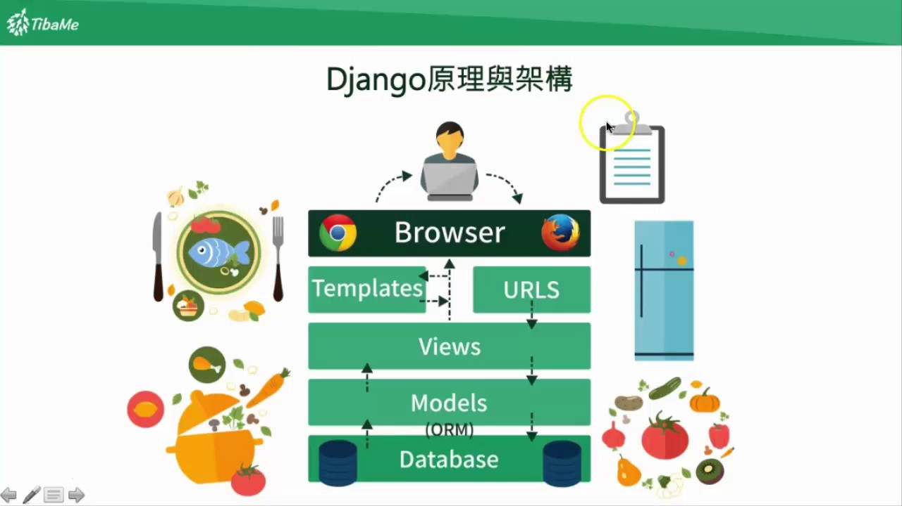

# django-todo-list

## environment
- [macOS 10.14.6](https://www.apple.com/tw/macos/mojave/)
- [PyCharm 2019.2.3](https://www.jetbrains.com/pycharm/)
- [Python 3.7.4](https://www.python.org/)
- [Django 2.2.5](https://github.com/django/django)
- [Django REST framework 3.10.3](https://github.com/encode/django-rest-framework)

## [Django](https://www.djangoproject.com)
Python 網頁開發框架之一


- [Wiki](https://zh.wikipedia.org/wiki/Django)
- [Django Note](https://github.com/arthurc0102/Note/tree/master/School/NTUB/IRC/class_2016.10.11_to_2016.11.08)
- [Django CORS headers](https://github.com/ottoyiu/django-cors-headers)
- [Core API](https://github.com/core-api/python-client)
- [Django JET](https://github.com/geex-arts/django-jet)
- [Bootstrap 4 for Django](https://github.com/zostera/django-bootstrap4)
- [IPython](https://github.com/ipython/ipython)
- [Django Extensions](https://github.com/django-extensions/django-extensions)

## Python
```shell
$ python
$ print("Hello World")

# 執行Python檔 -> python <檔案名稱>.py
$ python C:\Users\user\Desktop\main.py
# 清空shell
$ Windows: cls
$ macOS: clear

# 哪裡有 Python
$ where python

# 分享檔案
$ python -m http.server
```

### 基礎語法
```python
# 基本型別
x = 60 # Int
y = 'Hello' # String
z = True # Bool

print(x) # 60
print(y) # Hello
print(z) # True

# if 流程控制 - 選擇
if z:
    print(x) # 60
    print(y) # Hello

print(z) # True

if x > 60:
    print('及格')
elif x < 60:
    print('不及格')
else: # x == 60
    print('剛好壓線')
# 剛好壓線

# List 集合型別(類似陣列)
a = [1, 2, 3, 4, 5] #List
print(a) # [1, 2, 3, 4, 5]
print(a[0]) # 1
print(a[:3]) # [1, 2, 3]
print(a[3:]) # [4, 5]
# list_name[開始:結束:間隔]
print(a[::2]) # [1, 3, 5]

# 迭代
for i in a:
    print(i)
# 1
# 2
# 3
# 4
# 5
```

## virtual env
```shell
# 建立虛擬環境
$ python -m venv env

# 進入虛擬環境
$ Windows: .\env\Scripts\activate.bat
$ macOS: source ./env/bin/activate

# 退出虛擬環境
$ deactivate
```

## pip
Python package管理工具
```shell
# 顯示所有安裝的套件
$ pip list

# 安裝套件
$ pip install Django djangorestframework coreapi django-jet django-bootstrap4 ipython django-extensions

# 將套件版本列出 > 儲存至 requirements.txt
$ pip freeze > ./requirements.txt

# 根據 requirements.txt 安裝套件
$ pip install -r requirements.txt
```

## 建立 Django 專案
```shell
# 建立 Django 專案資料夾
$ mkdir <專案資料夾路徑>

# 開啟 Django 專案資料夾
$ cd <專案資料夾路徑>

# 建立 Django 專案 核心目錄
# django-admin startproject <資料夾名稱> <路徑>
# . -> 當前目錄下
$ django-admin startproject core .

# 當前目錄
$ Windows: dir
$ macOS: pwd

# 啟動開發用即時Server
$ python manage.py runserver # 預設 http://127.0.0.1:8000/

# 停止server >> ctrl c

# 建立 app
$ python manage.py startapp <app name>
```

## 核心目錄
```
manage.py # Django 指令程式
    core/
        __pycache__ # Django 快取檔
        __init__.py # 將目錄設為python package
        settings.py # Django 設定檔
        urls.py     # Django 網站路由設定檔
        wsgi.py
```

## settings.py
```python
# 是否開啟除錯模式
DEBUG = <Bool>

# DEBUG=False要設定允許的IP或Domain
ALLOWED_HOSTS = []

# 安裝 Django 套件或功能
INSTALLED_APPS = [
   'django.contrib.admin',
   'django.contrib.auth',
   'django.contrib.contenttypes',
   'django.contrib.sessions',
   'django.contrib.messages',
   'django.contrib.staticfiles',
]

# 語系
LANGUAGE_CODE = 'zh-Hant' # 舊版 'zh-tw'
# 時區
TIME_ZONE = 'Asia/Taipei'
```

## ORM Database
```shell
# 依照定義的 models 產生遷移紀錄檔
$ python manage.py makemigrations

# 依照 makemigrations(遷移紀錄檔) 對資料庫進行 CRUD
$ python manage.py migrate

# 建立 超級使用者
$ python manage.py createsuperuser
# 範例密碼 P@ssw0rd

# admin page url: http://127.0.0.1:8000/admin/

# python shell 模式
$ python manage.py shell

# 檢查 Django 專案
$ python manage.py check

# 安裝 MySQL 套件
$ pip install mysqlclient
```